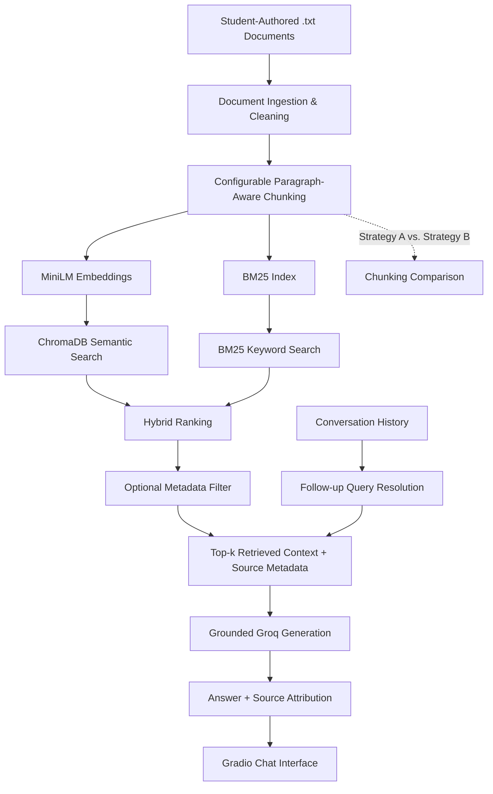

# Project 1 Planning – The Unofficial Guide

## Domain

For this project, I am building an **Unofficial Howard Mechanical Engineering Guide** focused on student experiences, course expectations, and practical advice for students going through the Mechanical Engineering program at Howard University.

A lot of useful information about engineering courses is not included in the official course catalog. The catalog can tell a student what a class is called and what topics it covers, but it does not really tell them what the workload feels like, which classes use MATLAB, what kinds of problems show up frequently, how much lab work to expect, or what students should know before taking the course. Most of this information normally gets passed between students through conversations, group chats, upperclassmen, and personal experience.

The goal of this guide is to collect that type of student knowledge and make it searchable through natural-language questions.

---

## Documents

The knowledge base currently contains 16 documents covering the Howard University Mechanical Engineering program, major required courses, technical electives, curriculum guidance, and student-perspective professor recommendations.

The corpus intentionally combines official Howard University information with an unofficial student perspective. Official sources provide factual information such as course descriptions, prerequisites, curriculum structure, and degree requirements, while the student-authored material provides practical recommendations that would normally be harder to find on an official university website.

### Current Corpus

1. `Mechanical Engineering Undergraduate Handbook.pdf`
   - Official Howard University Mechanical Engineering Undergraduate Program Handbook.
   - Contains the four-year curriculum, degree requirements, prerequisites and co-requisites, technical electives, academic policies, advising information, faculty information, and department resources.

2. `thermodynamics.txt`
   - Covers MEEG-304 Thermodynamics.
   - Includes major thermodynamics topics, its position in the Mechanical Engineering curriculum, and its relationship to later thermal-fluid courses.

3. `applied_thermodynamics.txt`
   - Covers MEEG-306 Applied Thermodynamics.
   - Includes applications such as thermodynamic cycles, combustion, engines, compressors, refrigeration, and energy systems.

4. `fluid_mechanics.txt`
   - Covers MEEG-307 Fluid Mechanics.
   - Includes fluid properties, statics, conservation of mass, momentum and energy, prerequisites, and connections to later thermal-fluid courses.

5. `heat_transfer.txt`
   - Covers MEEG-403 Heat Transfer.
   - Includes conduction, convection, radiation, steady and transient heat transfer, and its relationship to Thermodynamics and Fluid Mechanics.

6. `dynamics.txt`
   - Covers CIEG-302 Dynamics.
   - Includes particle and rigid-body motion, kinematics, kinetics, work-energy, impulse-momentum, and its role as a foundation for later dynamics courses.

7. `solid_mechanics.txt`
   - Covers MEEG-204 Solid Mechanics and related laboratory work.
   - Includes stress, strain, bending, Mohr's circle, deformation, and mechanical-property measurement.

8. `materials_science.txt`
   - Covers MEEG-209 Materials Science.
   - Includes relationships between material structure, processing, properties, and engineering performance.

9. `engineering_computations.txt`
   - Covers MEEG-207 Introduction to Engineering Computations.
   - Includes algorithm development, computational engineering problem solving, programming, and MATLAB.

10. `system_dynamics.txt`
    - Covers MEEG-301 System Dynamics.
    - Includes mathematical modeling, dynamic systems, feedback, controls, and mechanical/electrical/thermal system behavior.

11. `instrumentation.txt`
    - Covers MEEG-316 Instrumentation and Experimentation.
    - Includes engineering sensors, measurement systems, experimental data, error, and uncertainty analysis.

12. `vibrations.txt`
    - Covers MEEG-418 Vibration Analysis.
    - Includes single- and multi-degree-of-freedom vibration systems, mode shapes, numerical methods, and computational vibration analysis.

13. `senior_design.txt`
    - Covers the MEEG-441 and MEEG-442 Senior Project sequence.
    - Includes team-based engineering design, project development, reporting, and the two-semester senior design structure.

14. `mechanical_engineering_program.txt`
    - Provides a broader overview of Howard University's Mechanical Engineering program.
    - Covers major areas such as design and manufacturing, thermal and energy systems, mechanics, aerospace, experimentation, and engineering analysis.

15. `engineering_survival_guide.txt`
    - Provides a student-oriented overview of navigating the Howard Mechanical Engineering curriculum.
    - Connects foundational courses with later upper-level courses and highlights prerequisite chains, technical electives, and general curriculum planning.

16. `professor_recommendations.txt`
    - Student-authored recommendations based on firsthand course experience.
    - Includes comments on Emmanuel K. Glakpe, Achille Messac, Naren Vira, Nikolai Priezjev, and Gbadebo Owolabi.
    - Discusses teaching and problem-solving styles, relevant courses, areas of specialization, and suggestions for succeeding in their classes.

### Source Strategy

Most course-specific documents were created by extracting and reorganizing publicly available information from Howard University Mechanical Engineering program materials and course descriptions. The original Mechanical Engineering Undergraduate Handbook is also retained as a PDF so that the retrieval system can access the source document directly.

The professor recommendation document and portions of the engineering survival guide add student-generated knowledge that is not normally available in official course descriptions. These documents are clearly distinguished from official university information so the system does not present personal recommendations as university policy.

Using both types of documents allows the guide to answer factual questions such as:

- "What are the prerequisites for Fluid Mechanics?"
- "When do Mechanical Engineering students take Thermodynamics?"
- "What technical electives are available in aerospace?"

while also supporting unofficial-guide questions such as:

- "Who would you recommend for Thermodynamics?"
- "Which professor should I consider if I am interested in controls?"
- "What courses should I expect during junior year?"

---

## Chunking Strategy

I will use **paragraph-aware chunking** with a target chunk size of approximately **800 characters** and an overlap of approximately **150 characters**.

I chose paragraph-aware chunking because these documents are student notes and course reflections. Most individual ideas are naturally grouped into paragraphs. Keeping those paragraphs together should preserve more meaning than blindly cutting the text every fixed number of characters.

The target of around 800 characters should be large enough for a chunk to contain a complete thought, such as an explanation of what makes a course difficult or what students should expect from a lab, while still being small enough for semantic search to retrieve a specific topic instead of an entire document.

I am also using about 150 characters of overlap between neighboring chunks. The overlap is useful when an explanation continues across a chunk boundary. Without overlap, part of an important idea could end up in one chunk while the rest is placed in another, making both chunks less useful when retrieved independently.

If the chunks are too small, I would expect retrieval results to contain fragments that do not have enough context to answer a question. If the chunks are too large, each embedding could represent several unrelated ideas, making semantic retrieval less precise.

After chunking, I will inspect several chunks manually before embedding them to make sure they are readable on their own and still contain enough context to be useful.

---

## Retrieval Approach

For embeddings, I will use:

`sentence-transformers/all-MiniLM-L6-v2`

This model runs locally using the `sentence-transformers` library, so it does not require an API key or embedding API calls.

The generated embeddings will be stored in **ChromaDB** along with metadata identifying the source document and the chunk's position in that document.

For each user question, I will retrieve the **top 4 most semantically similar chunks**.

I chose `top-k = 4` as a starting point because it gives the generation model several possible pieces of relevant context without sending a large number of weakly related chunks. Retrieving too few chunks could miss information that is necessary to answer the question. Retrieving too many could introduce unrelated information and make the generated response less focused.

Semantic retrieval is useful for this project because students may phrase questions differently from the wording used in the source documents. For example, a student might ask which classes involve "coding," while a source document might specifically discuss MATLAB or data analysis. Embeddings allow the system to compare meaning rather than depending entirely on exact keyword matches.

If this system were being deployed for a much larger production application, I would also consider embedding accuracy, latency, model size, domain-specific performance, multilingual support, context length, API cost, and whether embeddings should be generated locally or through a hosted service.

---

## Stretch Feature Plan

In addition to the required RAG pipeline, I plan to implement all four stretch features. I want to use these features to test whether changes to retrieval and interface design actually improve the usefulness of the guide rather than adding them only as UI features.

### Hybrid Search

The primary stretch feature will be hybrid retrieval using both semantic similarity and BM25 keyword search.

The semantic component will continue to use `all-MiniLM-L6-v2` embeddings stored in ChromaDB. A BM25 index will also be built over the same document chunks. This gives the retrieval system two different signals:

- Semantic search is useful when the wording of the question differs from the wording in the documents but the meaning is similar.
- BM25 is useful when the question contains important exact terms such as `MATLAB`, `Thermodynamics`, `Senior Design`, or specific course concepts.

The results from the two retrieval methods will be combined into a single ranking. Because ChromaDB distance values and BM25 scores are on different scales, I will normalize or rank the results before combining them rather than directly adding the raw scores.

I will compare semantic-only retrieval against hybrid retrieval on at least three identical queries. For each query, I will record what each method returned and determine which method produced the more useful ranking.

### Chunking Strategy Comparison

My main chunking strategy uses paragraph-aware chunks with a target size of approximately 800 characters and 150 characters of overlap.

For the stretch comparison, I will implement at least one alternative strategy and evaluate both strategies using the same queries.

The alternative strategy will use smaller paragraph-aware chunks of approximately 400 characters with around 75 characters of overlap.

This comparison should help determine whether the larger chunks preserve useful context better or whether smaller chunks allow the retriever to identify more specific information.

I will not assume that the original strategy is better. I will compare actual retrieval results and document which strategy performed better for the test queries and why.

### Metadata Filtering

Every chunk will contain metadata including at least:

- source filename,
- chunk index,
- course/topic identifier where practical.

I will expose a source/topic filter that allows retrieval to be limited to a particular document or course.

For example, a user could ask a broad question about mathematical problem solving while filtering the corpus to `thermodynamics.txt`. I will demonstrate the same or similar query with and without the metadata filter so that the effect on the retrieved results is visible.

### Conversational Memory

The Gradio interface will support a small amount of conversational memory so users can ask follow-up questions without repeating the full subject.

For example:

**User:** What should I expect from Thermodynamics?

**Assistant:** [Answer grounded in the Thermodynamics-related retrieved documents.]

**User:** What about the exams?

The second question should be interpreted using the previous conversation context rather than as an unrelated query about exams.

Conversation history will be passed into the query/generation pipeline in a controlled way. Retrieved documents will still remain the factual source of the answer. Conversation memory should help resolve what the user is referring to, but it should not become a substitute for document grounding.

I will demonstrate at least one multi-turn exchange where the second question clearly depends on the first.

---

## Evaluation Plan

I will evaluate both the required RAG behavior and the retrieval changes introduced by the stretch features.

### Core Evaluation Questions

I will use five questions with specific expected answers.

#### Question 1

**Question:**  
What major analysis method should a student expect to use in Thermodynamics?

**Expected Answer:**  
The system should identify energy balances and control-volume analysis as major problem-solving methods used in Thermodynamics.

#### Question 2

**Question:**  
Which course in the document collection uses sensors, calibration, data acquisition, and MATLAB?

**Expected Answer:**  
Instrumentation. The response should identify Instrumentation as involving sensors, calibration, data acquisition, MATLAB, and experimental measurements.

#### Question 3

**Question:**  
What three major modes of heat transfer should a student expect to study in Heat Transfer?

**Expected Answer:**  
Conduction, convection, and radiation.

#### Question 4

**Question:**  
What kinds of work should a Mechanical Engineering student expect during Senior Design?

**Expected Answer:**  
The response should identify activities such as teamwork, design reviews, documentation, prototyping, system integration, and testing.

#### Question 5

**Question:**  
According to the guide, which course is mainly about designing aircraft wings?

**Expected Answer:**  
The system should state that the provided documents do not contain enough information to answer the question rather than answering from the LLM's outside knowledge.

For every question, I will record:

- question,
- expected answer,
- actual system response,
- retrieved sources,
- retrieved chunks,
- accuracy judgment (`accurate`, `partially accurate`, or `inaccurate`).

At least one genuine failure or limitation will be analyzed by tracing the problem to a specific stage of the pipeline, such as document coverage, chunking, retrieval ranking, or grounded generation.

### Retrieval Evaluation

I will separately test retrieval with at least three queries.

For each query I will record the highest-ranked chunks and explain why the returned information is or is not relevant.

At least two retrieval examples will include a written explanation of why the retrieved chunks are useful for answering the query.

### Hybrid Search Evaluation

I will run at least three identical queries through:

1. semantic-only retrieval, and
2. hybrid BM25 + semantic retrieval.

I will compare the returned rankings and identify which method performed better for each query.

This will help determine whether exact keyword matching improves retrieval for course names, software names, and engineering terminology.

### Chunking Comparison Evaluation

I will run the same query set against at least two chunking configurations:

**Strategy A**
- paragraph-aware
- approximately 800 characters
- approximately 150-character overlap

**Strategy B**
- paragraph-aware
- approximately 400 characters
- approximately 75-character overlap

I will compare the retrieved chunks and explain which strategy provides the better balance between context and retrieval specificity.

### Metadata Filtering Evaluation

I will demonstrate at least one query:

1. without a metadata filter, and
2. with a source/topic metadata filter.

The results should visibly change when the filter is applied.

### Conversational Memory Evaluation

I will demonstrate a multi-turn interaction where the second question depends on information from the first.

For example:

**User:** What should I expect from Thermodynamics?

**User follow-up:** What about the exams?

The second response should correctly interpret the follow-up as referring to Thermodynamics while still grounding factual claims in retrieved documents.

---

## Anticipated Challenges

One challenge is that the documents contain student-written information rather than standardized textbook descriptions. Different documents may use different terminology to describe similar concepts. Semantic embeddings should help with this, but some queries could still retrieve unexpected chunks.

A second challenge is choosing the right chunk size. If a paragraph or explanation is split in the wrong location, the retrieved chunk may only contain part of the information necessary to answer a question. The 150-character overlap is intended to reduce this problem, but I will still inspect the generated chunks manually.

Another possible issue is retrieving chunks that are semantically related to the question but do not actually contain enough information to answer it. For example, a question about a specific type of engineering software might retrieve general comments about technical coursework. I will inspect retrieval distance scores and the actual returned text when evaluating the system.

Grounding is another important challenge. The generation model already contains general knowledge about mechanical engineering, so it could answer questions that are not actually covered by my documents. I need the generation prompt to explicitly restrict answers to the retrieved context and return an insufficient-information response when the documents do not support an answer.

Source attribution also needs to remain connected to the retrieved chunks. Each chunk will therefore retain metadata containing its original filename and chunk index when stored in ChromaDB.

Hybrid retrieval introduces an additional ranking problem because BM25 scores and semantic similarity scores are not directly comparable. I will need to normalize or combine rankings carefully so that one retrieval method does not dominate simply because its numeric score has a different scale.

The chunking comparison may also reveal a tradeoff rather than one universally better strategy. Smaller chunks may retrieve highly specific sentences but lose surrounding context, while larger chunks may preserve complete explanations but contain several concepts that weaken embedding specificity.

Conversational memory creates another grounding risk. Previous conversation turns can help interpret references such as "that class," but previous model responses should not become factual evidence. Retrieved documents will remain the source of factual information.

Metadata filtering can improve precision but can also exclude relevant information from other documents. The interface should therefore make it clear when a filter is active.

---

## Architecture

The pipeline begins with student-authored text documents. The ingestion step loads and cleans the documents before the configurable paragraph-aware chunker divides them into retrievable sections.

Each chunk is converted into an embedding using `all-MiniLM-L6-v2` and stored in ChromaDB with its source metadata. The same chunks are also indexed using BM25 for keyword-based retrieval.

When a user asks a question, the system can use semantic retrieval alone or combine semantic and BM25 rankings through hybrid search. Optional metadata filtering can further narrow results by source or topic.

Conversation history is used only to help resolve references in follow-up questions. The retrieved documents remain the factual basis of the final answer.

The top-ranked chunks are passed to the Groq language model, which generates a grounded answer and displays the answer together with source attribution in the Gradio interface.

The chunking comparison is handled separately by rebuilding or testing the retrieval pipeline with different chunking configurations and comparing the results on the same queries.

---

## AI Tool Plan

I plan to use **ChatGPT and Codex** as development tools during implementation, but I will use the decisions in this planning document as the specification for what they should build.

### Ingestion and Chunking

I will give the AI tool the **Documents** and **Chunking Strategy** sections of this plan and ask it to help implement the document ingestion and `chunk_text()` functionality.

The generated code should:

- load `.txt` documents,
- clean unnecessary whitespace,
- preserve paragraph structure where possible,
- create chunks around the specified 800-character target,
- use approximately 150 characters of overlap,
- and attach source metadata.

I will inspect the resulting chunks to verify that the implementation actually follows the strategy described here.

### Embeddings and Vector Store

I will provide the **Retrieval Approach** and **Architecture** sections and ask the AI tool to implement embedding and vector storage using `all-MiniLM-L6-v2` and ChromaDB.

The implementation should preserve each chunk's source filename and chunk index as metadata.

### Semantic Retrieval

I will ask the AI tool to implement a retrieval function that accepts a natural-language question, embeds it, searches ChromaDB, and returns the top four chunks along with their source metadata and distance scores.

I will test retrieval separately before relying on the generation stage.

### Grounded Generation

I will ask the AI tool to connect the retrieved context to the Groq API.

The generation prompt must explicitly instruct the model to:

- answer only from the provided retrieved context,
- avoid using outside knowledge,
- avoid inventing unsupported facts,
- and say that there is not enough information when the documents do not support an answer.

Source attribution will also be handled using the metadata returned by retrieval instead of depending only on the LLM to generate citations correctly.

### Query Interface

I will ask the AI tool to implement a simple Gradio interface containing:

- a question input,
- an Ask button,
- an answer field,
- source information,
- optional metadata filters,
- and conversational history.

The interface should remain simple enough to demonstrate without requiring instructions.

### Evaluation and Debugging

I will use AI tools to help interpret errors and troubleshoot the pipeline if retrieval or generation does not behave as expected. I will provide the actual error messages, retrieved chunks, or outputs rather than asking the AI to assume what happened.

The final evaluation judgments will be based on the actual system outputs compared against the five expected answers defined above.

### Stretch Feature Implementation

For hybrid search, I will ask the AI coding tool to implement BM25 retrieval over the existing chunks and combine it with the semantic retrieval system described in this specification. I will provide the Retrieval Approach, Stretch Feature Plan, and Architecture sections so that the implementation follows the intended pipeline rather than introducing a separate retrieval architecture.

For the chunking comparison, I will ask the AI tool to make the existing chunking parameters configurable and create a repeatable comparison workflow. I will review the actual retrieved chunks myself rather than asking the AI to fabricate or predict which strategy performs better.

For metadata filtering, I will ask the AI tool to preserve and expose the source metadata already attached during ingestion and allow the retrieval function and Gradio interface to optionally filter by that metadata.

For conversational memory, I will ask the AI tool to add conversation history to the Gradio application and query pipeline. I will specifically review the implementation to make sure conversation history helps resolve follow-up questions without replacing retrieved documents as the factual grounding source.

For all stretch-feature evaluations, I will use actual runtime results. AI tools may help format or interpret those results, but they will not be asked to invent retrieval comparisons, system responses, or performance conclusions.
